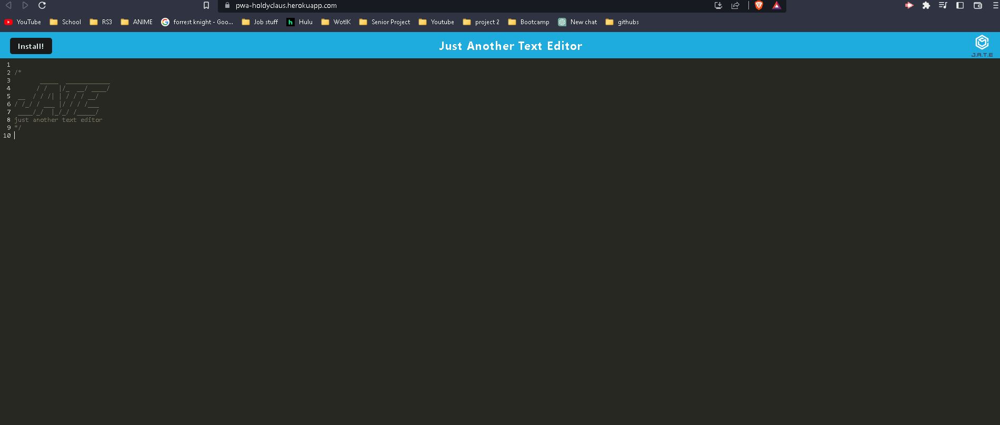
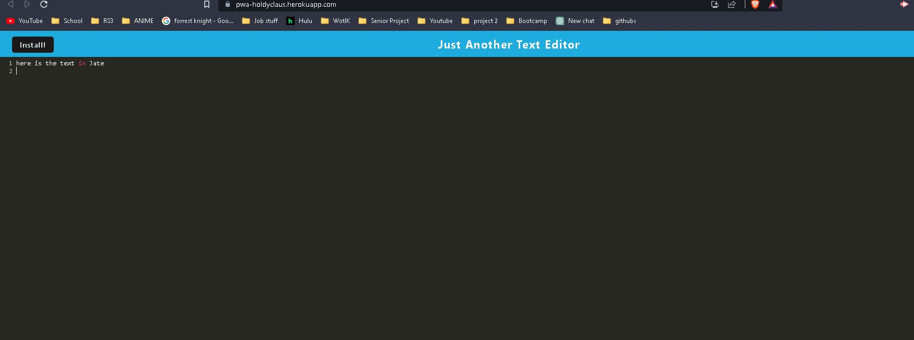
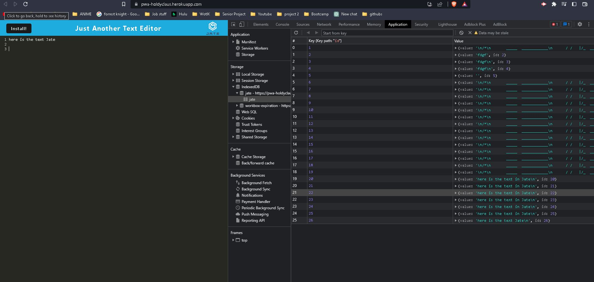

# Progressive-Web-Application-Holdy
UT Coding Bootcamp Challenge 19: Progressive Web App (PWA) Text Editor

## Description

> Your task is to build a text editor that runs in the browser. The app will be a single-page application that meets the PWA criteria.

## Table of Contents

- [Installation](#installation)
- [Usage](#usage)
- [Credits](#credits)
- [License](#license)

## Installation

https://pwa-holdyclaus.herokuapp.com/

## Usage

## Credits

Full-Stack Blog - [Professional README Guide](https://coding-boot-camp.github.io/full-stack/github/professional-readme-guide)

## License

Please see LICENSE file.

## Contributors
- Harrison - https://github.com/harrisonboatman
- Connor - https://github.com/connorbodin
- Michael Smith -
- Darren - https://github.com/medranomiler
- Josh Goeke -
- Camelia Benavides -
- Nick McCarthy -
- Rick Martinez https://github.com/Rick3Mrtz
- MJ Jeong -
- Jessica Ortega -